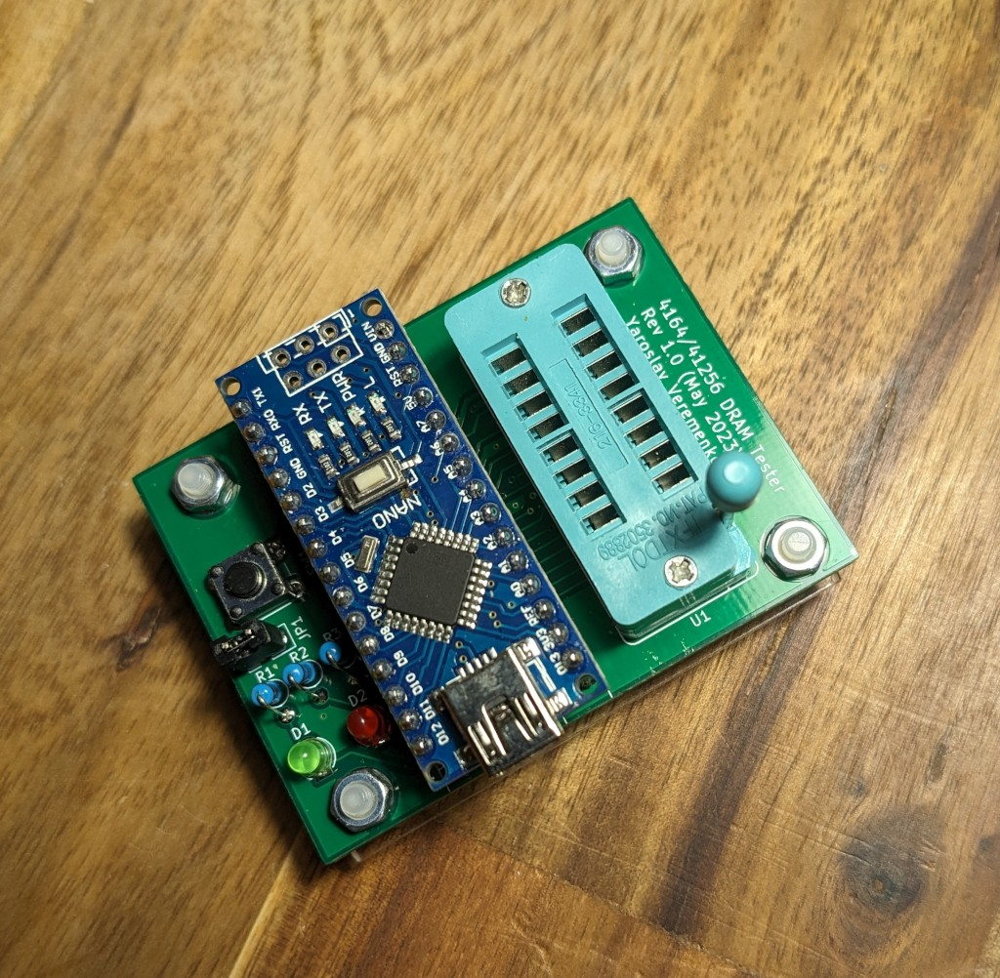

# DRAM Tester

Tester for 4164/41256 DRAM chips using Arduino Nano.

Based on https://github.com/Tishima/myDRAMTester, which is itself is based on https://forum.defence-force.org/viewtopic.php?t=1699

